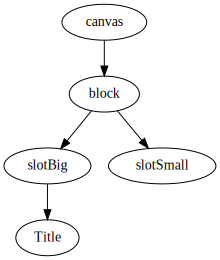

# Architecture

## Some Base notion

### Register
This supposed to be a noun. Copied from google translate:
>  an official list or record, for example of births, marriages, and deaths, of shipping, or of historic places.

So this is just a wrapper for a hash-table. The most striking example is [EBItemRegister](../src/AppState/Register/EBItemRegister.ts). This register things related to [EBItems (discussed later)](#ebitem).
That being said we basically grab the id of an item, and assign this id to something.
That something can be the way how to [make MJML template](#3-mjml-css-generator) for that item, how to serialize/compress an instance of an item, or how to create a [StateNode](#1-statenode) for that item.

### EBItem
This application consist of so-called items. (Obviously I should have found a more specific-phrase.)

These items represents well... categories of elements which can be put onto the canvas.
But actually the canvas itself is also considered as an instance of the CanvasItem. Block, Slot, Button, WYSIWYG section (called EditorToolPlugin), picture (called ImageToolPlugin) etc-etc are all considered as items.

#### Item Instance (Element) State
Each of the instance of items has their own state.
This state contains data about the instance, \
general ones such as paddings, margins, background color, and \
item-specific ones like text for a button, the division ratio for a block (2-1, 1-1-1, 1-2). \
This state must be serializable.

#### Item parts
Items need to provide a unique item id and the following:

##### 1. StateNode
An item need to have the possibility to create a StateNode.
A StateNode is basically a Node which is a mediator among a StateViewer, a state and if present a StateEditor. That means the item instances are presented on the canvas by their viewer. In case I click on a viewer, it gets selected which triggers an editor to be created and shown on the sidepanel.
In case we edit something with the editor the StateNode's state is being updated, and we also notify the viewer of the change so it can re-render itself.

This StateNode is also part of a tree called **AppState**. \
I.e. canvas has a block, which has a 2-1 ratio (big and small) for slots. Inside the first slot there's a Title instance.  So the AppState is like:



##### 2. StateEditor
This one is already mentioned. Nothing fancy about it.
An item needs to implement a `getEditor` method, which provides an item-specific editor for an item instance. So if the user selects a Title element on the canvas, then a `<eb-title-tool-editor>` component is being created, which (besides the general state fields like bg-color, paddings) has a field to change the title text.

##### 3. MJML-CSS Generator
This is a part of the app which has radically changed overtime. You can find the reason written in the [doc of my mistakes](./mistakes.md#weird-html-format).
So in order to convert our AppState into a genuine email-compatible html-like format first we have to "compile" each of our element into [mjml-template](https://mjml.io/)

As there used to be separate HTML & CSS generator, and also there's a compressor part - so multiple operations which involves the whole AppState - I used the [Visitor pattern](https://refactoring.guru/design-patterns/visitor).

Just for the sake of brevity and clarity let's not go into the details so deeply yet. Say each of the item can handle their own type of StateNode.
Meaning if you have a ButtonStateNode and you want to convert it into MJMLTemplate, then inside [ButtonToolPlugin](../src/ToolPlugin/ButtonTool/ButtonToolPlugin.ts) the #getMJMLCSSGenerator method returns a [ButtonMJMLCSSGenerator](../src/ToolPlugin/ButtonTool/ButtonMJMLCSGenerator.ts).
This generator accepts a ButtonStateNode and returns an `<mj-button>` template with the proper attributes.

In case the SN is a container one, then a [ContainerMJMLCSSGenerator](../src/AppState/EBItem/ContainerMJMLCSSGenerator.ts) is used, which first converts all of its children (recursively), then it places those mjml templates into its own template as nested ones.
So i.e. a SlotStateNode is being processed, and it has a Button and a Title children, then
1. ButtonElement --> `<MJMLButtonTemplate />`
2. TitleElement --> `<MJMLTitleTemplate />`
3. SlotStateNode -->
```html
<MJMLSlotTemplate>
    <MJMLButtonTemplate />
    <MJMLTitleTemplate />
</MJMLSlotTemplate>
```

##### 4. StateNodeCompressor
Lastly an item has a [StateNodeCompressor](../src/AppState/EBItem/StateNodeCompressor.ts) which is responsible for serializing and de-serializing the state nodes.
The purpose of this feature is to be able to save the AppState into a simple file / database.
It's similar to [MJML-CSS Generator](#3-mjml-css-generator) in the terms of that from each of the StateNode we get a string, and eventually all of these substrings are combined into one big string. This big combined string is basically the compressed/serialized AppState.\
Whenever we want to load back the state we also use the StateNodeCompressor. The string becomes the same AppState-tree that it used to be, and then we just replace the canvas's content with it.

#### Builtin Items
It must be mentioned that there are items which are available even without registering any additional plugins. These items are [CanvasItem](../src/AppState/BuiltInItem/Canvas/CanvasItem.ts), [BlockItem](../src/AppState/BuiltInItem/Block/BlockItem.ts) and [SlotItem](../src/AppState/BuiltInItem/Slot/SlotItem.ts)

##### CanvasItem
It kinda speaks for itself. This one is the "element category" of canvas. There can be only one canvas in the AppState and it must be the root element in.
The only direct children it can have are Block elements (discussed right after).

##### BlockItem
A block item represents a row (in desktop) or a column (in mobile). From the user's perspective you are not able to add any elements to the canvas without first injecting a block element.
From the dev's perspective it's a bit different.
BlockItems **MUST HAVE** at least one slot child. Based on it's division rate, there can be 1, 2 or 3 Slot children. Also the only type that a Block element accepts as a child is the Slot element.

##### SlotItem
The only container item (so far) that can have arbitrary children (except Canvas & Block). Whenever the user adds a new element to the canvas then it's going to be a child of one of the slot elements.

#### Plugins
A plugin is also an item, but has one more thing to do: provide an icon which gets shown on the sidepanel, and can be used by the user to create an element by drag-n-drop the icon onto one of the slot elements.

## Plugin-base architecture
I wanted to comply with the [open-closed principle](https://en.wikipedia.org/wiki/Open%E2%80%93closed_principle).

As we discussed there are some responsibilities of the items/plugins:
- generate it's ~~html~~ MJML code
- ~~generate it's css~~
- serialize/compress its elements
- deserialize/uncompress its elements
- provide possibility to copy its instance on the canvas
- provide an editor component on the sidepanel to edit one of its element's state
- provide a viewer component for canvas


#### State changes: commands
// TODO:

#### Commands
They are reversable.
Commands bring from a consistent state into another consistent state.
All commands are reversable, meaning there's an undo method on them, which goes back from one consistent state, to an another one.

// TODO:


// TODO: put this into the correct place
An example of the visitor & register:

There's a class called [AppHTMLGenerator](../src/AppState/AppHTMLGenerator.ts) which is the root of the HTML generation. It produces some wrapper mjml-template, but the majority of the work is delegated to the [mjmlVisitorRegister](../src/AppState/Register/Visitor/AppMJMLVisitorRegister.ts). As discussed above, register is something that bears a list. Also this is a visitor which visits all of the StateNodes of the AppState.
The way it handles each StateNode is, that first it gets the itemID from the StateNode. Then based on that id it gets its corresponding registry. That registry is basically the MJMLCSSGenerator of that particular item. The item-specific MJMLCSSGenerator can handle its kind of StateNode, so it returns the mjml-template. In case the StateNode is a ContainerStateNode (so it can have children), then its children StateNodes are also processed by AppMJMLVisitorRegister.

An example: the current element is a Button. The [ButtonToolPlugin](../src/ToolPlugin/ButtonTool/ButtonToolPlugin.ts) provides a [ButtonMJMLCSSGenerator]()