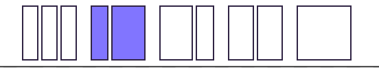

# Architecture

This is an overview of the architecture I used for this project.

## EBItem
This application consists of so-called items. (Obviously I should have found a more specific-phrase like ElementCategory so that its instances should have been Elements.)

These items represents well... categories of elements which can be put onto the canvas.
Actually the canvas itself is also considered as an instance of the CanvasItem. \
Block, Slot, Button, WYSIWYG section (called EditorToolPlugin), picture (called ImageToolPlugin) etc-etc are all considered as items.

## Item Instance (Element) State
Each of the instance of items has their own state. This state contains data about the instance
- general ones such as paddings, margins, background color
- item-specific ones like text for a button, the division ratio for a block (2-1, 1-1-1, 1-2), url path for images.

This state must be serializable.

## Item parts
Items need to provide a unique item id and the following:

### 1. StateEditor
An item needs to implement a `getEditor` method, which provides an item-specific editor for an item instance.
With this editor you can change the [state of the selected element](#item-instance-element-state).
So if the user selects a Title element on the canvas, then an `<eb-title-tool-editor>` component is created, which (besides the general state fields like bg-color, paddings) has a field to change the title text.


*Editor is on the right side*

### 2. StateNode
An item needs to have the possibility to create a StateNode.
A StateNode is a Node which is a mediator among a [`StateViewer`](#stateviewer), a [`state`](#item-instance-element-state) and if present a [`StateEditor`](#1-stateeditor).

> side note: sometimes I use the abbreviation `SN` to refer to StateNode

#### StateViewer

Item instances are presented on the canvas by their viewer. \
I.e. If we create a new instance of Button (with [ButtonToolPlugin](../src/ToolPlugin/ButtonTool/ButtonToolPlugin.ts)),
then it is presented by [\<eb-button-tool-viewer>](../src/ToolPlugin/ButtonTool/ButtonToolPlugin.ts?plane1#35) on the canvas.


*Viewer is on the left side*

In case I click on a viewer, it gets selected which triggers an editor to be created and shown on the sidepanel.
In case we edit something on the SN's state (with the editor, or by undo or redo a command), then SN updates its viewer and its editor (if presents - maybe we reverted a command while other element was selected.)

> side note: there can be only one editor at a time.

#### AppState

StateNodes are also part of a tree called **AppState**. \
I.e. canvas has a block, which has a 2-1 ratio (big and small) for slots and inside the first slot there's a Title instance,

in this case the **AppState** looks like this:


*A possible AppState with 5 elements*

#### StateNode restrictions
A StateNode must have a [StateViewer](#stateviewer), must have a [state](#item-instance-element-state), and has one or zero [StateEditor](#1-stateeditor)

### 3. MJML-CSS Generator
This is a part of the app which has radically changed overtime. You can find the reason written in the [doc of my mistakes](./mistakes.md#weird-html-format).
So in order to convert our AppState into a genuine email-compatible html-like format,
first we have to "compile" each of our element into [mjml-template](https://mjml.io/)

As there used to be separate HTML & CSS generator, and also there's a compressor part - so multiple operations which involves the whole AppState - I used the [Visitor pattern](https://refactoring.guru/design-patterns/visitor).

For the sake of brevity and clarity let's not go into the details so deeply yet. Say each of the item can handle their own type of StateNode.
Meaning if you have a ButtonStateNode and you want to convert it into MJMLTemplate, then inside [ButtonToolPlugin](../src/ToolPlugin/ButtonTool/ButtonToolPlugin.ts) the #getMJMLCSSGenerator method returns a [ButtonMJMLCSSGenerator](../src/ToolPlugin/ButtonTool/ButtonMJMLCSGenerator.ts).
This generator accepts a ButtonStateNode and returns an `<mj-button>` template with the proper attributes.

In case the SN is a container one, then a [ContainerMJMLCSSGenerator](../src/AppState/EBItem/ContainerMJMLCSSGenerator.ts) is used, which first converts all of its children (recursively), then it places those mjml templates into its own template as nested ones.

So i.e. a SlotStateNode is being processed, and it has a Button and a Title children, then (pseudo-code coming)
1. ButtonElement --> `<MJMLButtonTemplate />`
2. TitleElement --> `<MJMLTitleTemplate />`
3. SlotStateNode -->
```html
<MJMLSlotTemplate>
    <MJMLButtonTemplate />
    <MJMLTitleTemplate />
</MJMLSlotTemplate>
```

### 4. StateNodeCompressor
Lastly an item has a [StateNodeCompressor](../src/AppState/EBItem/StateNodeCompressor.ts) which is responsible for serializing and de-serializing the state nodes.
The purpose of this feature is to be able to save the AppState into a simple file / wherever.
It's similar to [MJML-CSS Generator](#3-mjml-css-generator) in the terms of that from each of the StateNode we get a string, and eventually all of these substrings are combined into one big string. This big combined string is the compressed/serialized AppState.\
Whenever we want to load back the state we also use the StateNodeCompressor. The string becomes the same AppState-tree that it used to be, and then we replace the canvas's content with it.

## Built-in Items
There are some built-in items which does not need to be registered manually.
These items are [CanvasItem](../src/AppState/BuiltInItem/Canvas/CanvasItem.ts), [BlockItem](../src/AppState/BuiltInItem/Block/BlockItem.ts) and [SlotItem](../src/AppState/BuiltInItem/Slot/SlotItem.ts)

### CanvasItem
This one is the "canvas category". There can be only one canvas in the AppState and it must be the root element.
The only direct children it can have are Block elements.

### BlockItem
A block instance represents a row (in desktop and tablet) or a column (in mobile). From the user's perspective you are not able to add any elements to the canvas without first injecting a block element.



*Block types based on its ratio: 1-1-1, 1-2, 2-1, 1-1, 1*

From the dev's perspective it's a bit different.
BlockItems **MUST HAVE** at least one slot child. Based on it's division rate, there can be 1, 2 or 3 Slot children. Also the only type that a Block element accepts as a child is the Slot element.

### SlotItem
The only container item (so far) that can have arbitrary children (except Canvas & Block). Whenever the user adds a new element to the canvas then it's going to be a child of one of the slot elements.

## Plugins

It is possible to register "extra items" to the application. These "extra items" are called plugins or tools and have to comply with the [ToolPlugin](../src/ToolPlugin/ToolPlugin.ts) interface.
This way the application uses the [open-closed principle](https://en.wikipedia.org/wiki/Open%E2%80%93closed_principle).
A plugin is also an item, but has one more thing to do: provide an icon which gets shown on the sidepanel, and can be used by the user to create an element by drag-n-drop the icon onto one of the slot elements.


*6 icons for plugins*

After registering a tool, the user is able to drag-n-drop it into a slot.


*drag and drop a tool into a slot*

### Register
`Register` supposed to be a noun. Copied from google translate:
>  an official list or record, for example of births, marriages, and deaths, of shipping, or of historic places.

So this is a wrapper for a hash-table. The most striking example is [EBItemRegister](../src/AppState/Register/EBItemRegister.ts). This registers things related to [EBItems](#ebitem).
That being said we grab the id of an item, and assign this id to something.
That something can be the way how to [make MJML template](#3-mjml-css-generator) for that item, how to [serialize/compress](#4-statenodecompressor) an instance of an item, or how to create a [StateNode](#2-statenode) for that item.

### How RegisterVisitor works

As we discussed there are some responsibilities of the items (including plugins):
- generate it's ~~html~~ MJML code
- ~~generate it's css~~
- serialize/compress its elements
- deserialize/uncompress its elements
- provide possibility to copy its instance on the canvas
- provide an editor component on the sidepanel to edit one of its element's state
- provide a viewer component for canvas

#### Visitor part
As the AppState is a tree of state nodes, and each of the state node is processed based on its type, so we need to know which SN belongs to which item.
All SN [has the corresponding](../src/AppState/StateNode/StateNode.ts?plain=1#L20) item's id.
Furthermore we need to know how each item handles their operations,
therefore I created a [register](#register) for each operation (MJML generation, serialization, deserialization...) [to track](#register-part) how that operation is carried out for each item.

Just to clarify it let's put serialization as an example.
There's a [AppCompressorRegister](../src/AppState/Register/Visitor/AppCompressorRegister.ts) which registers the way how to compress its SN for each item.
Before we try to serialize the AppState, we have to [register each item](#register-part) to AppCompressorRegister. After registering every item, the AppCompressor knows exactly how to compress each SN. So we have to traverse each node, based on its item id we get the (item-specific) compress operator from the AppCompressorRegister, and apply it to the SN (which belongs to the particular item).


#### Register part
As aforementioned each operation need to be implemented for each item.
As an example let's check [ButtonToolPlugin](../src/ToolPlugin/ButtonTool/ButtonToolPlugin.ts). ButtonToolPlugin implements how a ButtonStateNode [serailized/deserialized](../src/ToolPlugin/ButtonTool/ButtonToolPlugin.ts?plane1#L40) or [turned into mjml template](../src/ToolPlugin/ButtonTool/ButtonToolPlugin.ts?plane1#L46).

So in order to be able to process a ButtonStateNode (for whatever operation), we have to register these implementations into an "OperationRegister".
- AppCompressorRegister - registers the way a StateNode is serialized
- AppDecompressorRegister - registers the way a serialized state is turned back into a StateNode
- AppMJMLVisitorRegister - registers the way how a StateNode is turned into an mjml template

In pseudo code:
```typescript

const allOperationRegister = [AppCompressorRegister.getInstance(), AppDecompressorRegister.getInstance(),AppMJMLVisitorRegister.getInstance(), /*...*/ ];

const allItems = [CanvasItem, ButtonToolPlugin, /*...*/ ];

allOperationRegister.forEach(register => allItems.forEach(item => register.registerItem(item)));
```

#### EBItemManager
The real code is in [EBItemManager](../src/AppState/EBItemManager.ts). It pre-registers all [built-in items](#built-in-items) and accepts plugins.

## AppFlow

### state changes: Commands
Since this application supposed to be an editor, therefore I had to implement the undo/redo mechanism.
For this one the most obvious pattern is [command pattern](https://refactoring.guru/design-patterns/command).

I created a [RevertableCommand interface](../src/command/RevertableCommand.ts), the usual things are written:
- execute (do)
- undo

Plus there's an extra one: isExecutable.

### CommandManager

There's a [CommandManager](../src/command/CommandManager.ts) unit that has the responsibility to check whether the commands are executable, execute them in case yes, undo the commands, keep track of the history chain.


There's one special case that must be mentioned:


*A possible history-chain change in the CommandManager*

Let's say we have 5 commands initially: A,B,C,D,E
Since E was the last executed command, therefore internally in CommandManager there's a pointer which points to it.

Let's say the user wants to undo the last 2 commands, namingly E and D. In this case we first call the E's undo method, then D's undo method. Meanwhile we update the >>last executed command's<< pointer. So that means the pointer now points to C.

In this case if the user executes a new F command, then we alter the history chain, and end up with the bottom graph, meaning we lost the D and E commands.

This is a usual behaviour among those apps which provides history (i.e. vs code), but it's good to visualize this.

### Views

There are 3 [device views](../src/views.ts) in the project, namingly Desktop, Tablet and Phone.
[The concept](../src/pillar/preview/eb-preview.ts?plane1#L85) is easy, we create an iframe with the width associated to a device view, compile the AppState to html, and feed the iframe with the compiled html.

### Events

Another big segment of the architecture is event handling.
My intention was to make a de-centralized structure of events with type-safe arguments.


#### Event groups
I tried to group the events based on their emission origin or place of impact.
For instance I created a [sidepanel.event.ts](../src/events/sidepanel.event.ts), where the sidepanel-related events are grouped.
Here's the `'sidepanel-view-change'` event which occurs when
- the user switches among `'editor'`, `'tools'`, `'global'` views
- when something triggers a sidepanel view change i.e. inserting a new `SN` then sidepanel automatically switches to the editor view of that `SN`.

These are the groups that were created:
- *SidePanelEmailBuilderEventMap* mentioned above
- *OutgoingEventMap* for sending messages to the [host application](../README.md#what-are-those-buttons-in-the-header)
- *CommandEmailBuilderEventMap* for undo/redo events
- *ToolbarEmailBuilderEventMap* extends *CommandEmailBuilderEventMap* \
for preview related events
- *HeaderEmailBuilderEventMap* for debugs and initiating sending events
i.e.`'request-send-app-state'` triggers [`'send-app-state'`](../src/events/handlers/provider/HeaderEventHandler.ts?plane1#L86)
- *CanvasEmailBuilderEventMap* extends *CommandEmailBuilderEventMap* \
for every canvas-related events (selection, moving, hover, state-change etc-etc)

> side note: undo/redo events - I don't remember for the reason - supposed to be at multiple places (not just at toolbar)
> that's why `CommandEmailBuilderEventMap` is being extended by `ToolbarEmailBuilderEventMap` and `CanvasEmailBuilderEventMap`

#### EBEventHandler
A handler which handles a group of events. I.e. [SidePanelEventHandler](../src/events/handlers/provider/SidePanelEventHandler.ts) handles all events which are described in [SidePanelEmailBuilderEventMap](../src/events/sidepanel.event.ts)
#### EventHandlerProvider
Collects all EBEventHandler and provides it to EBEventHandlerManager
#### EBEventHandlerManager
Gets the `<eb-root>` component and connects/disconnects all EventHandlers to it. As a result, regardless where an event comes from, eventually it propagates up to `<eb-root>` which can handle it with the help of the EventHandlers.

As all event handlers are wrapped with [stop propagation HoF](../src/events/handlers/StopPropagationWrapper.ts), therefore no event "escapes" from the app, only those ones which are [supposed to leave](../src/events/outgoing-event.ts) the app.

### A complex example how things works

Let's say a user dragged the button tool and dropped it into a slot.

#### Event part
The drop event on slot triggers a [`state-node-drop-zone`](../src/AppState/Lit/BasicContainerViewerLit.ts?plane1#L76) event.
That event propagates up to `<eb-root>`.

> side note: [dispatchEBEvent](../src/events/app.event.ts?plane1#L22) create events with `composed: true`, therefore it [goes through shadow DOM boundaries](https://developer.mozilla.org/en-US/docs/Web/API/Event/composed)

As previously
- `<eb-root>` [initiated](../src/eb-root.ts?plane1#L95) the event handlers by the [EBEventHandlerManager](#ebeventhandlermanager),
- and the manager got all handlers from the [EventHandlerProvider](#eventhandlerprovider) including [CanvasEventHandler](../src/events/handlers/provider/EventHandlerProvider.ts?plane1#L25)
- and CanvasEventHandler [can handle](../src/events/handlers/provider/CanvasEventHandler.ts?plane1#L53) `state-node-drop-zone` event

therefore as soon as the event reaches `<eb-root>`, it invokes [CanvasEventHandler#handleDrop](../src/events/handlers/provider/CanvasEventHandler.ts?plane1#L126).

> side note: due to the user drag, there was a preceding `'icon-drag-start'` event [occurred here](../src/pillar/main/sidepanel/eb-tool-icon.ts?plane1#L84) and [handled here](../src/events/handlers/provider/SidePanelEventHandler.ts?plane1#L28), so that it filled up DragService#draggedIcon previously

Since there's a draggedIcon in the dragService, we invoke [insertToolNode](../src/events/handlers/provider/CanvasEventHandler.ts?plane1#L175) method. We get the itemID from the dragService.

#### CommandManager part

We form an `InsertToolNodeCommand`. This command receives the id of the item (tool/plugin) and the drop-related data (which container to insert and at what position.)
Before we try to execute that command, first we verify whether the command is executable or not.
In case yes, then with the help of the [CommandManager](#commandmanager) we apply the command. As the CommandManager executed the command, the CommandManager was able to attach the command to its history-chain.

#### Command part

[`InsertToolNodeCommand`](../src/command/MouseCommand/InsertToolNodeCommand.ts) first tries to create an `SN` with the given `itemID` and calculates the index where to insert (among children) the `new SN` into the `container SN`

The creation of the `new SN` is handled by the StateNodeFactory 

Before we apply the command, it checks
- if with the given item ID an instance could be created
- if the `container SN` can accept the `created SN`.

In case the command is executable, then the `container SN` inserts the `created SN` among its children, so that `created SN` is injected into the [AppState](#appstate).

#### Creation of a new SN
For creating the `new SN` we use the [StateNodeFactory](../src/AppState/Register/StateNodeFactory.ts).
The StateNodeFactory is not just a factory, but a [register](#register) as well, which assigns the itemID to the way an [item can be instantiated](../src/AppState/Register/StateNodeFactory.ts?plane1#L17).

At bootstrapping the app we [register all available plugins](../src/eb-root.ts?plane1#L28) with [EBItemManager](#ebitemmanager).
By registering the ButtonTool we tell how
- AppCompressorRegister should handle compressing for `ButtonStateNode`s
- AppDecompressorRegister should handle decompressing for compressed `ButtonStateNode`s
- ...
- StateNodeFactory should create a new `ButtonStateNode`

So what really happens from the perspective of StateNodeFactory and ButtonToolPlugin:
```typescript
StateNodeFactory.getInstance().registerItem(buttonToolPlugin)
```

From now on if I do the following
```typescript
const buttonItemID = 'button';
const newSN = StateNodeFactory.getInstance().createStateNodeBy(buttonItemID);
```
Then `newSN` will have a value produced by [ButtonToolPlugin#createStateNode](../src/ToolPlugin/ButtonTool/ButtonToolPlugin.ts?plane1#L34).