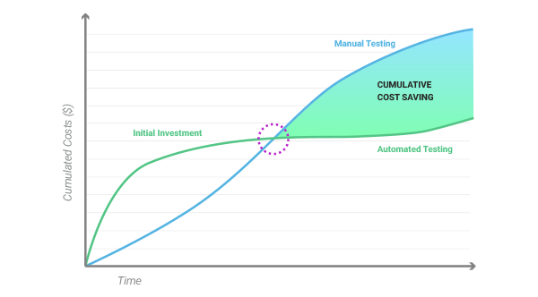

# Mistakes

Yes, mistakes are the worst things to talk about but on the other hand these are the things that gives you the most hands-on experience.

## Lack of tests
The entry level costs for automated tests are higher than manual tests, that's obvious. On the other hand in the long run it pays off to use them next to / instead of manual tests. 


 \
*Picture is from [nextgen's post](https://resources.nextgen-technology.com/automated-testing-measure-roi)*


Given the estimated time of this project, I can say that for us manual tests would have been sufficient.
The thing is (this brings us a project-related and not code-related problem) we miserably [misestimated the project](#weird-html-format).

I'm trying to be as succinct as possible. Tests gives you
- Directly
  - confidence that your code works
  - proof to you and to your customer/co-worker that a certain part of the code complies with the given acceptance criteria
  - ability to easily check whether your refactor was successful
  - easier debugging; clues where to find a problem, especially when integrating a 3rd party package
- Indirectly
  - [examples](https://www.youtube.com/watch?v=i37i6DE5kxg) how to use your code (basically an API description)
  - loosely-coupled structure

In case you are an experienced dev, you can achieve the "Indirectly" part, but you can't acquire the "Directly" one.

There's a person who is one of the most competent person in the world regarding clean code, and that's Robert C. Martin aka. Mr. Clean Code. [Check out his lecture](https://youtu.be/Qjywrq2gM8o?si=kmR2PmDBFs87ZzBV&t=1907).
(I'd like to highlight the part about code coverage.)

Also there's a part of the same lecture regarding [manual vs automated tests](https://youtu.be/Qjywrq2gM8o?si=CQ0lN6DxFRG2pHqB&t=2790).

**Key takeaway**:
1. Estimate Properly
2. Write tests

## Obviously a lot of TODO comments left
Again this is something that Robert C. Martin [can tell you](https://youtu.be/2a_ytyt9sf8?si=EJh7Bo-lnRKP9gdV&t=1498) in a much more brief, elegant and profound way, but to put it in a nutshell:
if you commit a TODO it's 90% that never going to be done.

**Key takeaway**:
Don't leave TODOs or you end up having a lot of TODOs everywhere and technical debts that you build upon.

## Proper naming
This is something that was already mentioned in the [architecture part](./architecture.md#ebitem), but let's just elaborate on it a bit.

There's a notion coming from [Domain Driven Design](https://martinfowler.com/bliki/DomainDrivenDesign.html) called [Ubiquitous Language](https://martinfowler.com/bliki/UbiquitousLanguage.html).
It basically means, that everyone understands the phrases that you use in the project regardless their role, including future-you in 2 years.

If the names are ambiguous, the project becomes cluttered.

If you have [proper tests](#lack-of-tests), you can be confident that you don't break the code without noticing it.
If you can change the code, you can rename things.
If you can rename things, you can tidy the codebase.

**Key takeaway**:
The most important documentation is the code itself. If you take time to make proper namings, you made sure that the project is maintainable.

## Weird HTML format
Since an email could be written in html my initial thought was that basically we need to create an HTML editor, rather than a specific email builder. I could not make bigger mistake than that. The thing is that an email written in html is not a simple html5 file, rather a weird html4. Or not even that one. You don't even know how your email is going to be interpreted as you don't control the doctype.
Check out this [SO conversation](https://stackoverflow.com/questions/9136002/what-version-of-html-to-use-in-emails)

There's a website which is similar to [caniuse.com](https://caniuse.com), called [caniemail.com](https://www.caniemail.com/). There you can check what are the features which are usable across the clients. Spoiler alert: not much.

Just look at [flexbox](https://www.caniemail.com/search/?s=flex). `display: flex` has an okay-ish support ~83%, but `justify-content` has ~58.5%.

The time I realized that it is not going to work with a simple html5 generated file was the point, where I already implemented an HTMLGenerator, and a CSSGenerator visitor. That was a really harsh realization.

**Key takeaway**: Always start with appropriate tests. In my case I should have sent an email with more than just a simple div with some texts.

## Lack of Dependency Injection

To tell you the truth, I didn't spend time to find a proper npm package which could be used as DI in a frameworkless environment and has proper API.

Instead I just made my odd solution. Classes with default constructor parameters, allowed me to use all of them like `new MyClass()`.
With this I was able to create singleton instances on the class itself (so a static field, see [class.util.ts](../src/common/utils/class.util.ts)).

But this came with costs:
- Only singleton instances can be made
- All classes had to have default parameters (even when it doesn't make sense)
- In case of a circular dependency, I could pull my hair out to find the problem - meanwhile a DI tool can easily show you the circle.

**Key takeaway**: Always find the proper tool for the job. In most cases there are some guys on the other side of the internet who spent much more time to produce a solution for a specific problem than you.

Take your time, find that tool, it worth the effort. \
(For DI I use [tsyringe](https://www.npmjs.com/package/tsyringe) nowadays - developed by microsoft, which is very similar to Angular's DI.)

## LitElement inside AppState (for Visualization)
Due to the lack of knowledge I was not able to cut off Lit from my base classes - such as StateEditor, SelectableViewer - which are the fundamental parts of the visualization of the state. They should have nothing to do with the framework/library I use.
The only things that they need to rely on are the [Custom element lifecycle callbacks](https://developer.mozilla.org/en-US/docs/Web/API/Web_components/Using_custom_elements#custom_element_lifecycle_callbacks)

The way it should have been done:
```typescript
type LifeCycleBearerHTMLElement = {
  connectedCallback(): void;
  disconnectedCallback(): void;
} & HTMLElement

const StateEditorMixin = (CustomComponent: { new(): LifeCycleBearerHTMLElement }) => {
  // this part should not rely on Lit
  abstract class StateEditorCustomComponent extends CustomComponent {
    public stateNode!: StateNode;
    // ... the rest of the code from the current StateEditorLit ...
  }

  return StateEditorCustomComponent;
};

class AnItemEditor extends StateEditorMixin(LitElement) { // this can be lit specific
  public connectedCallback(): void {
    super.connectedCallback();
    console.log('hello world');
  }

  public doSg(): void {
    dispatchEBEvent(this, 'copy-state-node', this.stateNode);
  }
}
```

**Key takeaway**: Mixins

## Hack due to the lack of ES module

This is not necessarily a mistake, but a topic which was time-consuming.

Let's check the end of the _node_modules/tinymce/tinymce.js_ (with version 6.4.1). You can clearly see that it's not made for ES modules.

```javascript
30593. const exportToModuleLoaders = tinymce => {
30594.    if (typeof module === 'object') {
30595.      try {
30596.        module.exports = tinymce;
30597.      } catch (_) {
30598.      }
30599.    }
30600.  };
30601.  const exportToWindowGlobal = tinymce => {
30602.  window.tinymce = tinymce;
30603.    window.tinyMCE = tinymce;
30604.  };
30605.  exportToWindowGlobal(tinymce);
30606.  exportToModuleLoaders(tinymce);
```

So I ran into problems like:
> Error: 'default' is not exported by node_modules/tinymce/tinymce.js, imported by out-tsc/src/ToolPlugin/EditorTool/eb-editor-tool-editor.js

I tried `import * as tinymce from 'tinymce'` which lead me to the very same problem.

After that I tried importing tinymce as a side-effect module:

```typescript
import 'tinymce';
import 'tinymce/themes/silver';
import 'tinymce/models/dom';
import 'tinymce/plugins/link';
import 'tinymce/plugins/lists';
import 'tinymce/plugins/emoticons';
import 'tinymce/plugins/anchor';
import 'tinymce/plugins/table';
import 'tinymce/plugins/help';
import 'tinymce/plugins/fullscreen';
import 'tinymce/icons/default';
```

But of course if you check the corresponding .js files the following error is obvious:
> Uncaught ReferenceError: require is not defined

I had the same problem with _node_modules/mjml-core/lib/index.js_ (version 4.14.1).

Of course I could search for some plugin which can mix up commonjs with es modules, but at that point I already spent too much time on figuring this out.

Eventually, in order to use them I referenced those two files directly from index.html as a simple script.

For simple `npm run start` this was enough. But in order to bundle it when using `npm run build` I basically needed to copy their minified version. You can see that in [_rollup.config.js_](../rollup.config.js?plane1#L25).

**Key takeaway**: write your JS software in the era of ES modules. 😁